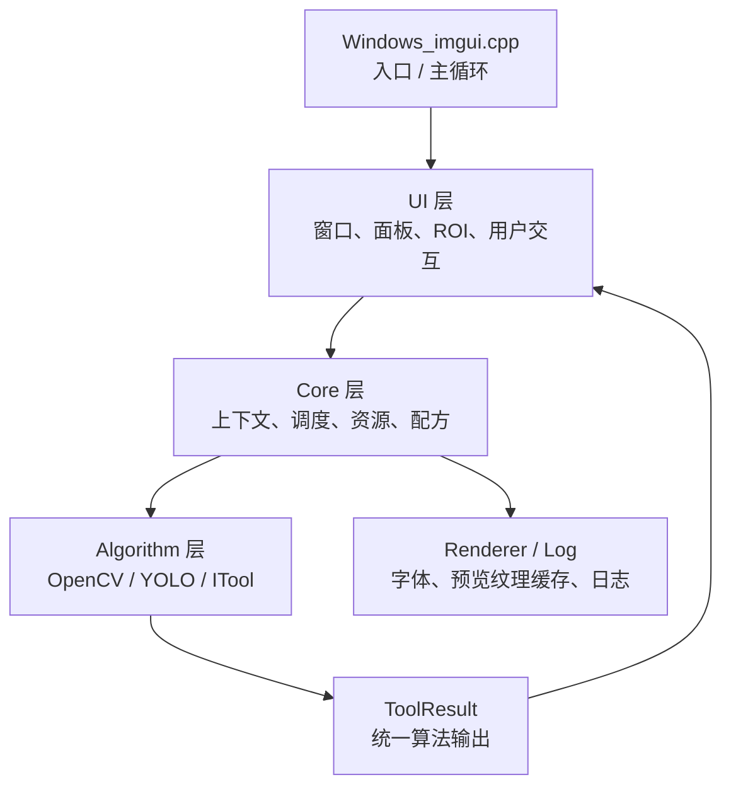
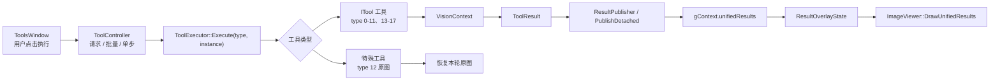

# 项目代码结构梳理

> 文档同步日期：2026-08-16。本文已补充 DX12/DX11 双后端、任务分组、独立输入、独立流程图、统一结果、任务并行、16 槽多相机、视频 YOLO、Per-Monitor DPI 和 PLC 单槽握手的代码边界。

## 2026-08-02 图形后端代码边界

| 层次 | 文件 | 职责 |
| --- | --- | --- |
| Contract | `Core/RenderBackend.h` | 定义统一初始化、清理、新帧、遮挡、Resize、渲染、等待和纹理生命周期接口 |
| Facade | `Core/GraphicsBackend.*` | 启动时优先 DX12、失败自动回退 DX11，保存失败原因并向 UI/业务提供单一入口 |
| DX12 | `Core/DX12Backend.*`、`Core/DX12Context.*` | 适配并完整保留 DX12 设备、交换链、帧同步、描述符和上传实现 |
| DX11 | `Core/DX11Context.*` | 独立实现 D3D11 设备、交换链、RenderTarget、ImGui 后端和纹理上传/释放 |
| Renderer | `Renderer/PreviewTextureCache.*` | 只保存通用纹理句柄和 `ImTextureID`，不暴露 D3D11/D3D12 类型 |
| UI | `Windows_imgui.cpp`、`UI/*` | 共用一套布局、字体、Docking、图片、Resize、多视口和最大化行为 |

## 2026-07-27 任务与硬件执行代码边界

| 层次 | 文件 | 职责 |
| --- | --- | --- |
| Core | `Core/ToolChainState.*` | 保存最多 16 个任务的顺序、启用状态、输入设置和工具归属 |
| Core | `Core/ToolController.*` | 生成执行顺序、准备任务图片、推进文件夹、处理相机回退和任务并行 |
| Core | `Core/HardwareRuntimeService.*` | 异步相机帧、PLC 轮询、单槽 Trigger/Busy/Done/ACK 握手、结果输出与重连 |
| Core | `Core/HardwareSettingsService.*` | 硬件设置持久化、IO 映射校验、任务 Trigger 自动补齐与标准映射生成 |
| Core | `Core/RecipeManager.*` | 保存和加载任务图片、文件夹进度及相机优先字段 |
| UI | `UI/ToolsWindow.cpp` | 任务管理、输入配置、自适应多行流程图、执行全部/当前任务/单步/并行入口 |
| UI | `UI/RunResultWindow.cpp` | 任务结果总览、详情、结果图、缩放和本轮总耗时 |
| Test | `Test/regression_tests.cpp` | 验证任务顺序、独立图片、文件夹、相机回退、并行、PLC 指定任务与连续触发丢弃 |

算法、设备、统计和渲染模块的其余边界见下文；任务的用户操作规则见 `docs/TASK_GROUPS.md`。
本文档根据当前源码整理项目结构、模块职责、主流程和主要数据流，方便后续维护、重构和新增算法工具。

## 项目定位

`IMgui_Opencv` 是一个基于 Dear ImGui、DirectX 12 / DirectX 11、OpenCV 的 Windows 桌面视觉工具。项目使用 Visual Studio C++ 工程组织，核心能力包括图片/视频加载、ROI 管理、图像处理、模板匹配、YOLO 检测、轮廓/形状/直线检测、形态学、颜色分析、多点找色、OCR、结果导出、工具链输入、配方保存加载和日志显示。

主要技术栈：

| 类型 | 使用内容 |
| --- | --- |
| UI | Dear ImGui，Docking，多视口 |
| 渲染 | DirectX 12 优先，初始化失败自动回退 DirectX 11 |
| 图像处理 | OpenCV |
| 推理 | ONNX Runtime / OpenCV DNN / NCNN；OpenCV 5.0 YOLO 实验工具和 PP-OCRv6 tiny OCR |
| 配置/配方 | nlohmann/json |
| 平台 | Win32，XAudio2，Media Foundation |
| 工程 | Visual Studio C++20，`Windows_imgui.vcxproj` |

## 顶层目录

```text
IMgui_Opencv/
├── Algorithm/              # 视觉算法和 ITool 工具实现
├── Core/                   # 应用核心、上下文、调度、资源与配方
├── UI/                     # Dear ImGui 窗口、交互和 ROI 管理
├── Renderer/               # 字体、工具预览图和任务结果图纹理缓存
├── Log/                    # 日志系统
├── include/                # 第三方头文件和 ImGui 源码
├── assets/                 # 字体、测试图片等资源
├── models/                 # ONNX/PT/NCNN 模型、类别文件、测试视频/图片
├── redist/                 # 本地/Release 运行时 DLL 和 lib
├── recipes/                # 配方文件及模板资源
├── Test/                   # C++ 回归测试工程
├── docs/                   # 项目文档
├── Windows_imgui.cpp       # Win32 / GraphicsBackend / ImGui 程序入口和主循环
├── Windows_imgui.h         # 公共头文件汇总和通用转换函数
├── framework.h             # Windows 基础头文件
└── Windows_imgui.vcxproj   # Visual Studio C++ 工程文件
```

## 分层结构

项目整体接近 `UI -> Core -> Algorithm` 的三层结构，但仍保留一些历史全局状态。



当前架构里比较重要的约定：

- UI 负责显示窗口、收集参数、编辑 ROI 和触发执行。
- Core 负责保存运行上下文、调度工具、执行工具、加载资源和管理配方。
- Algorithm 封装具体视觉算法；当前 type 0-11、13-17 已接入 `ITool`，type 12 原图由 `ToolController` 特殊处理。
- UI、业务和预览缓存只依赖 `GraphicsBackend` 与通用纹理句柄，不读取 D3D11/D3D12 全局资源。

## 程序入口和主循环

入口文件是 `Windows_imgui.cpp`，入口函数是 `wWinMain()`。

主流程：

1. 设置 DPI 感知和窗口缩放。
2. 创建 Win32 主窗口。
3. 初始化 `GraphicsBackend`：优先创建 DirectX 12，失败时记录原因并自动创建 DirectX 11。
4. 初始化 Dear ImGui，启用键盘、手柄、Docking、多视口。
5. 加载主题和中文字体。
6. 进入主循环。
7. 每帧处理 Windows 消息。
8. 开启 ImGui 新帧。
9. 绘制各 UI 窗口。
10. 更新视频帧和实时 YOLO 检测。
11. 调用当前后端执行纹理提交、ImGui 渲染、多视口更新和 Present。
12. 退出时通过统一接口清理纹理、当前图形后端和 Win32 资源。

主循环里直接调用的 UI/算法入口包括：

```text
UI::DrawDockSpaceHost()
UI::ShowSidebar()
UI::ShowLogWindow()
UI::ShowStatsWindow()
UI::ShowHardwareWindow()
UI::ShowOpenCV()
UI::ShowToolsWindow()
UI::ShowRunResultWindow()
VideoCapture::Update()
HardwareRuntimeService::Tick()
LiveYoloRunner::Update()
ImageLoadController::Update()
GraphicsBackend::RenderAndPresent()
```

`UI::ShowToolsWindow()` 内部每帧调用 `ToolController::Tick()`，因此单步、批量、循环和并行任务的推进仍由 Core 调度器完成，不是 UI 直接执行算法。

## UI 模块

目录：`UI/`

| 文件 | 职责 |
| --- | --- |
| `DockSpaceHost.*` | 主 DockSpace、菜单栏和全局窗口显示开关；通过 `Core/ROI.h` 使用 ROI 类型 |
| `ImageViewer.*` | 图片窗口、缩放平移、文件夹图片列表、上一张/下一张、图片清理 |
| `ROIManager.*` | ROI 创建、选择、拖动、缩放、绘制、坐标转换 |
| `ToolsWindow.*` | 工具实例、任务管理、任务输入、独立“工具流程图”窗口，以及全部/当前任务/单步/循环/任务并行入口；公共表单行负责参数对齐 |
| `RunResultWindow.*` | 任务结果总览、任务详情、结果图和本轮总耗时 |
| `RunResultLayout.*` | 结果窗口尺寸、任务卡片网格和覆盖标签避让等无渲染布局策略 |
| `Sidebar.*` | ROI 控制面板；启动时默认隐藏，通过“查看 → 侧边栏控制”手动打开 |
| `HardwareWindow.*` | 与控制面板位于同一左侧停靠区的设备连接页签 |
| `LogWindow.*` | 日志窗口显示 |
| `StatsWindow.*` | 性能统计窗口 |

`ToolsWindow.cpp` 只在右侧工具区保留“打开流程图窗口”入口；流程图本体使用独立 ImGui 窗口，不再占用工具列表顶部高度。节点按窗口宽度自动换行，常规窗口中的 16 工具默认形成 4 列多行布局；长标题在节点内裁切并提供悬停完整名称，跨行顺序线与结果 ROI/Fixture 依赖线分别绘制。任务设置中的“绑定相机”使用标签/控件两列表格，执行区预留并行状态和工具数量两行，避免窄窗口或底部日志区导致文字裁切。

工具 ROI 使用显式绑定语义：`ToolExecutor::SelectSearchROIs()` 在 `searchROIs` 为空时返回空集合，不能回退到 `ROIState` 的画布 ROI；`PrepareDetachedSnapshot()` 和 `LiveYoloRunner` 使用相同规则。绑定 ROI 仍可通过 `runtimeId` 跟随画布编辑后的几何位置。

### ROI 数据结构

ROI 定义在 `Core/ROI.h`，使用图像像素坐标存储。`runtimeId` 用于 UI 运行期关联，`type` 表示 ROI 类型，`start/end` 保存主要端点或包围范围，`angle` 保存矩形旋转角度，`points` 保存多边形顶点。

支持类型：

| 类型 | 含义 |
| --- | --- |
| `ROI_TYPE_RECT` | 矩形 |
| `ROI_TYPE_POINT` | 点 |
| `ROI_TYPE_LINE` | 线段 |
| `ROI_TYPE_CIRCLE` | 圆 |
| `ROI_TYPE_POLYGON` | 多边形 |

`ROI` 使用 `start/end/points` 保存图像坐标，并提供：

- `ToCvRect()`：转成 OpenCV 的 `cv::Rect`
- `CircleRadius()`：圆形 ROI 半径
- `IsEmpty()`：判断 ROI 是否为空

ROI 相关职责分为三层：

- `Core/ROIState.*`：持有 ROI 集合和当前选择。
- `Core/ROIEditorState.*`：持有绘制序列、拖动、控制点等编辑状态。
- `UI/ROIManager.cpp`：负责坐标转换、命中检测、绘制，并调用 Core 状态接口完成交互。

## Core 模块

目录：`Core/`

| 文件 | 职责 |
| --- | --- |
| `RenderBackend.h` | DX11 / DX12 统一接口与通用纹理句柄 |
| `GraphicsBackend.*` | 后端选择、回退、统一渲染/Resize/纹理门面和主图片纹理 |
| `DX12Backend.*` | 把保留的 DX12 实现适配到统一契约，并管理 DX12 通用纹理 |
| `DX12Context.*` | 完整保留的 DX12 设备、交换链、描述符堆、帧上下文和 GPU 资源辅助 |
| `DX11Context.*` | 独立 DX11 设备、交换链、RenderTarget、遮挡处理和通用纹理实现 |
| `AsyncImageLoader.*` | 后台线程异步加载图片 |
| `OpenFileDialog.*` | 文件/文件夹选择对话框 |
| `VideoCapture.*` | 视频文件和摄像头播放，基于 `cv::VideoCapture` |
| `AudioPlayer.*` | 音频播放和视频同步 |
| `ThemeManager.*` | 工业视觉深色/浅色主题、统一控件尺寸和 `theme.cfg` 持久化 |
| `RecipeManager.*` | 配方保存、加载、应用和工具实例序列化 |
| `ImageState.*` | 当前图、原图和图像版本状态收口 |
| `ROI.h` / `ROIState.*` | ROI 数据结构和当前 ROI 选择状态 |
| `FrameSourceState.*` | 单图、图片序列、视频、摄像头帧来源状态 |
| `FrameNavigation.*` | 图片序列导航，以及视频/摄像头播放状态快照与控制命令 |
| `ImageLoadController.*` | 图片加载请求、异步加载回调和上传调度 |
| `ImageImportService.*` | 单图/递归文件夹导入、导航与输入切换状态清理 |
| `HardwareAdapters.*` | 工业相机、PLC、Modbus TCP、OPC UA 适配器接口与注册 |
| `HardwareRuntimeService.*` | 设备连接、异步相机抓帧、PLC 输入轮询、单槽握手、结果聚合及 OK/NG/Error 输出协调 |
| `HardwareSettingsService.*` | 硬件 JSON 设置、IO 表校验、旧配置兼容和任务 Trigger 地址同步 |
| `OpenCvCameraAdapter.*` | UVC、摄像头索引和 OpenCV 视频流 URL 的通用相机实现 |
| `ModbusTcpAdapter.*` | Winsock Modbus TCP 01/03/05/06 客户端与协议校验 |
| `TcpTextAdapter.*` | 普通 TCP 文本结果输出，支持可配置 Pass/Fail 内容且不等待响应 |
| `ModbusPlcAdapter.*` | PLC 标签到 Modbus 线圈/寄存器及工程量的映射 |
| `Open62541OpcUaAdapter.*` | open62541 原生 OPC UA TCP 客户端、NodeId 与标量读写 |
| `../UI/HardwareWindow.*` | 左侧设备连接页签中的工业相机和结果输出配置，仅调用 HardwareRuntimeService API |
| `LiveYoloRunner.*` | 实时 YOLO 推理调度和耗时统计 |
| `VisionContext.*` | 统一视觉上下文，保存图片、ROI、模板和结果 |
| `ImageViewState.*` | Core-owned image zoom, pan, canvas position, and grid settings |
| `ToolInstance.h` / `ToolTypes.h` | 工具实例参数、类型常量和工具名称 |
| `ToolChainState.*` | 工具链状态、任务定义、任务顺序、任务图片和工具归属 |
| `ToolROIService.*` | 工具搜索 ROI 与测量 ROI 的编辑、恢复、同步、回滚和删除 |
| `ResultOverlayState.*` | 统一结果、实时检测和 Fixture 叠加层查询与显示策略 |
| `ToolExecutor.*` | 统一工具执行入口，按工具类型分发 |
| `ToolController.*` | 工具执行调度器，支持单个、全部、当前任务、任务单步、循环和任务并行 |
| `ResultPublisher.h` | 结果发布相关声明 |
| `ResultExporter.*` | JSON 结果、PNG 结果截图和 Markdown 运行报告导出 |
| `ImageUtils.h` | 图像格式转换和安全上传辅助 |
| `ToolChainPreflight.*` / `ToolChainValidator.*` | 运行前资源检查、依赖校验和循环依赖检测 |

### VisionContext

`VisionContext` 是算法执行的统一上下文，定义在 `Core/VisionContext.h`。

核心字段：

| 字段 | 含义 |
| --- | --- |
| `image` | 当前处理图像 |
| `originalImage` | 原始图像备份 |
| `imageVersion` | 图像版本号 |
| `width/height` | 图像尺寸 |
| `rois` | 当前 ROI 列表 |
| `selectedROI` | 当前选中的 ROI |
| `frozenTemplate` | 当前冻结模板 |
| `unifiedResults` | 统一工具输出 |

全局实例是：

```cpp
extern VisionContext gContext;
```

它为工具执行提供统一上下文。图像状态由 `ImageState` 管理，工具通过
`VisionContext` 读取输入并通过 `ToolResult` 发布结果，不再同步旧的图像全局变量。

### ToolController

`Core/ToolController.*` 负责执行调度，不直接实现算法。

支持的模式：

| 模式 | 说明 |
| --- | --- |
| `Idle` | 空闲 |
| `Running` | 正在执行 |
| `Waiting` | 预留等待状态 |

主要接口：

```cpp
ToolController::RequestRun(int toolIndex)
ToolController::RequestRunAll(bool loop = false)
ToolController::RequestRunTaskGroup(const std::string& groupName, bool loop = false)
ToolController::RequestStepNext()
ToolController::RequestStepNextTaskGroup(const std::string& groupName)
ToolController::RequestStepReset()
ToolController::Tick()
ToolController::Reset()
```

每帧由 `ToolsWindow` 调用 `Tick()`，调度器再调用 `ToolExecutor::Execute()`。任务顺序由 `BuildBatchExecutionOrder()` 生成：跳过禁用任务，按正式任务顺序收集工具，最后加入未分组工具。

工具行和“上步耗时”记录单工具执行成本；一轮完成时 `s_batchTotalMs` 使用开始到完成的墙钟时间。结果总览标题的“本轮总耗时”因此包含逐帧调度和并行等待，更接近用户实际等待时间。任务详情中的任务耗时仍由该任务各工具耗时汇总。

### ToolExecutor

`Core/ToolExecutor.*` 是工具统一执行入口。

分发关系：

| type | 工具 | 执行路径 |
| --- | --- | --- |
| 0 | 边缘检测 | `RunViaITool()`，`EdgeTool` |
| 1 | 模板匹配 | `RunViaITool()`，`TemplateMatchingTool` |
| 2 | Blob 分析 | `RunViaITool()`，`BlobTool`，特征筛选、区域与统一测量判定 |
| 3 | 阈值调试 | `RunViaITool()`，`ThresholdITool` |
| 4 | YOLO 检测 | `RunViaITool()` |
| 5 | 轮廓分析 | `RunViaITool()` |
| 6 | 形状匹配 | `RunViaITool()` |
| 7 | 直线检测 | `RunViaITool()` |
| 8 | 形态学 | `RunViaITool()`，`MorphologyITool` |
| 9 | 颜色分析 | `RunViaITool()`，`ColorAnalyzerITool` |
| 10 | 多点找色 | `RunViaITool()` |
| 11 | YOLO OpenCV 5.0 | `RunViaITool()`，`OpenCVYoloITool`，OpenCV DNN 实验工具 |
| 12 | 原图 | `ToolController` 中恢复本轮原图，作为工具链重置节点 |
| 13 | OCR 文字识别 | `RunViaITool()`，`OCRTool`，PP-OCRv6 tiny + NCNN |
| 14 | 二维码/条码识别 | `RunViaITool()`，`QRCodeTool`，ZXing-cpp/OpenCV |
| 15 | 工业测量 | `RunViaITool()`，`MeasurementTool`，卡尺、拟合、标定和公差 |
| 16 | 图像差分 | `RunViaITool()`，`DifferenceTool`，参考图差异区域 |
| 17 | 几何绘制 | `RunViaITool()`，`GeometryDrawTool`，配方化几何图元 |

`RunViaITool()` 会把 `ToolInstance` 中的 UI 参数同步到具体 `ITool` 实例，再把当前图像、ROI、模板写入 `gContext`，最后执行：

```cpp
ToolResult result = it.toolImpl->Execute(gContext);
```

执行结果经 `ResultPublisher` 发布到 `gContext.unifiedResults`；并行任务产生的脱离主执行上下文结果由 `ToolExecutor::PublishDetached()` 发布。显示层再通过 `ResultOverlayState::Results()` 查询，最终由 `ImageViewer::DrawUnifiedResults()` 统一叠加。

`Core/ToolResultUtils.h` 统一生成线段结果标签。存在 `measurements[name="value"]` 时优先显示结构化数值和单位，因此工业测量在主图与任务结果总览中保持相同的完整标签。任务分组不设置启动兜底；空配方保持零任务，用户点击“+ 新建任务”后才由 `ToolChainState::CreateTaskGroup()` 创建任务。

## Algorithm 模块

目录：`Algorithm/`

| 文件 | 职责 |
| --- | --- |
| `ITool.*` | 工具抽象接口和工具注册表 |
| `ToolResult.h` | 统一算法输出结构 |
| `ToolImageUtils.*` | 工具输入图像准备、ROI 裁剪和图像辅助 |
| `FrameSource.h` | 单图/序列/视频/摄像头统一帧包 |
| `EdgeTool.*` | 边缘检测 ITool 实现 |
| `BlobTool.*` | Blob 分析 ITool 实现 |
| `ThresholdITool.cpp` | 阈值调试 ITool 适配层 |
| `YOLOTool.*` | YOLO 工具的 `ITool` 实现 |
| `YOLODetector.*` | YOLO 模型加载、推理、NMS、结果绘制 |
| `OpenCVYoloDetector.*` | OpenCV DNN YOLO 实验检测器 |
| `ShapeTools.*` | 轮廓、形状、直线工具的 `ITool` 实现 |
| `TemplateMatchingTool.*` | 模板预处理、旋转搜索、NMS 和结果发布 |
| `ContourDetector.*` | 轮廓检测和分析 |
| `ShapeMatcher.*` | 形状匹配 |
| `LineDetector.*` | Canny + HoughLinesP 直线检测 |
| `MorphologyTool.*` | 腐蚀、膨胀、开闭运算等形态学处理 |
| `ColorAnalyzer.*` | 色彩空间分析和直方图 |
| `ThresholdTool.*` | 灰度、模糊、阈值、Canny 管线 |
| `MultiColorFinder.*` | 多点找色工具 |
| `OCRTool.*` | OCR 工具 ITool 实现、缓存、ROI 和结果转换 |
| `WindowsPPOCREngine.*` | PP-OCRv6 tiny NCNN 模型加载、检测和识别 |

### ITool 接口

`ITool` 是新工具接口：

```cpp
class ITool
{
public:
    virtual const char* GetName() const = 0;
    virtual int GetType() const = 0;
    virtual ToolResult Execute(VisionContext& ctx) = 0;
    virtual void DrawUI() = 0;
    virtual nlohmann::json Save() const = 0;
    virtual void Load(const nlohmann::json& j) = 0;
};
```

当前自动注册的工具类型包括：

| type | 工具 |
| --- | --- |
| 0 | 边缘检测 |
| 1 | 模板匹配 |
| 2 | Blob 分析 |
| 3 | 阈值调试 |
| 4 | YOLO 检测 |
| 5 | 轮廓分析 |
| 6 | 形状匹配 |
| 7 | 直线检测 |
| 8 | 形态学 |
| 9 | 颜色分析 |
| 10 | 多点找色 |
| 11 | YOLO OpenCV 5.0 |
| 13 | OCR 文字识别 |

工具通过 `ToolRegistry` 注册和创建：

```cpp
ToolRegistry::Register(type, factory)
ToolRegistry::Create(type)
ITool::Create(type)
```

### ToolResult

`ToolResult` 是统一算法输出结构，定义在 `Algorithm/ToolResult.h`。

支持输出：

| 字段 | 用途 |
| --- | --- |
| `sourceToolIndex/sourceToolId` | 结果来源工具的兼容索引与稳定 ID |
| `status/statusReason` | Pass/Fail/Error 与判定原因 |
| `success/skipped/message` | 算法成功、跳过和运行消息 |
| `timing` | prepare/execute/publish/wall 与后端分段耗时 |
| `measurements` | 面积、长度、角度等通用测量值 |
| `regions` | 轮廓、Blob、形状匹配区域 |
| `detections` | YOLO/分类检测框 |
| `lines` | 直线检测结果 |
| `texts` | OCR 文本框、文本内容和置信度 |
| `debugImage` | 可选调试图像 |

这套结构是 UI 统一叠加绘制和结果管理的基础。

`Core/ToolResultCapabilities.h` 是 type 0-17 的静态输出能力契约。`ToolsWindow` 用它过滤结果 ROI/Fixture 上游并显示输出种类，`ToolChainValidator` 用它拒绝不兼容依赖；实际运行结果仍以 `ToolResult` 中非空字段为准。`ResultROIResolver` 和 `FixtureTransform` 统一消费区域、检测框、线段与文本框，避免 UI 与执行后端各维护一套白名单。结果 ROI 默认输出包围矩形，并支持第 N 项、全部项和 A/B 双结果；A、B 可来自同一或不同上游。工业测量模式 0 由 `ToolExecutor` 请求专用几何，把区域类结果转换为中心点、把线结果保留为线 ROI；双结果模式把两项分别转成点，三个执行入口保持一致。

## 工具实例系统

工具实例定义在 `Core/ToolInstance.h` 的 `ToolInstance`，UI 只编辑实例参数。

每个 `ToolInstance` 保存一个工具的全部 UI 参数和运行状态，例如：

- 模板匹配参数：模板图、旋转范围、匹配阈值、NMS、搜索 ROI。
- YOLO 参数：模型路径、类别路径、置信度、NMS、ROI、GPU 开关。
- 轮廓参数：灰度、模糊、阈值、面积过滤、凸性过滤。
- 形状匹配参数：模板、方法、分数、预处理。
- 直线检测参数：Canny、长度、角度、最大线条数。
- 形态学参数：操作类型、核大小、核形状、迭代次数。
- 颜色分析参数：色彩空间、直方图 bins、高度。
- 多点找色参数：参考图、锚点、ROI、最大结果数、距离阈值。
- OpenCV 5.0 YOLO 实验参数：模型路径、类别路径、置信度、NMS、实时测试/Helper 测速。
- OCR 参数：检测/识别模型 param/bin、字典、置信度、最大文本数、输入尺寸、ROI 开关。
- 输入来源参数：`inputSourceMode`，支持上一步原图、上一步处理图、原图工具输出。

执行路径如下：



## 数据流

### 图片数据流

```text
文件选择 / 文件夹浏览 / 相机帧
    -> ImageImportService / FrameNavigation / HardwareRuntimeService
    -> AsyncImageLoader（文件异步解码）
    -> ImageState::Current() / ImageState::Original()
    -> SafeConvertToRGBA()
    -> GraphicsBackend::UploadMainTexture（由当前后端上传）
    -> UI::ShowOpenCV() 显示
```

任务执行还会在进入工具链前解析任务输入：

```text
已连接相机新帧（仅相机优先任务）
    -> 任务文件夹或任务单图
    -> 当前公共图片
    -> 同一任务内按工具顺序传递
    -> ToolController::GetTaskResultImage() 保存任务结果图
```

PLC 指定任务触发不复用“执行全部”的任务并发队列，而是使用独立单槽握手：

```text
Modbus FC01 轮询 Trigger / ACK
    -> 空闲且出现目标 Trigger 上升沿
    -> HardwareRuntimeService 记录唯一待执行任务并输出 Busy
    -> UI 主线程 Tick 请求 ToolController 只执行该任务
    -> 在线相机 / 任务文件夹 / 任务单图 / 公共图片
    -> 聚合 Pass / Fail / Error
    -> Busy OFF + Done + OK/NG/Error
    -> 等待 ACK 上升沿并清除输出
```

从请求已接收直到 ACK 完成期间，额外 Trigger 只增加忽略计数，不进入队列、不在后续补跑。相机在线但本轮抓帧失败时输出 Error；只有相机未连接时才回退到任务文件夹或单图。

### 视频数据流

```text
视频文件 / 摄像头
    -> VideoCapture::Update()
    -> 当前帧 cv::Mat
    -> ImageState::Current() / GPU 上传
    -> ImageViewer 显示
    -> 可选 YOLO 实时检测
```

### 算法数据流

```text
当前图像 + ROI + 工具参数
    -> ToolInstance
    -> ToolController::Tick()
    -> ToolExecutor::Execute()
    -> Algorithm / ITool
    -> ToolResult
    -> ResultPublisher / ToolExecutor::PublishDetached()
    -> gContext.unifiedResults
    -> ResultOverlayState::Results()
    -> ImageViewer::DrawUnifiedResults() / 日志输出
```

### 配方数据流

```text
当前工具实例 + ROI + 模板 + 输入来源 + 参数
    -> RecipeManager::Capture()
    -> RecipeData / ToolInstance JSON + recipe asset compatibility
    -> JSON .recipe 文件
    -> RecipeManager::Load()
    -> RecipeManager::Apply()
    -> 恢复 UI 和工具参数
```

## 配方系统

`Core/RecipeManager.*` 负责把当前运行状态保存为配方文件，并在后续恢复。

核心数据结构：

| 结构 | 用途 |
| --- | --- |
| `RecipeData` | 一个完整配方 |
| `RecipeToolInstance` | ToolInstance JSON 与模板/差分/找色资产快照 |
| `ToolInstance::ToRecipeJson()` | 单个工具实例的参数序列化主入口 |
| `RecipeROI` | ROI 序列化 |
| `RecipeThreshold` | 阈值/图像处理参数 |
| `RecipeTemplateMatch` | 模板匹配参数 |

配方支持：

- 保存工具列表、每个工具的参数和输入来源 `inputSourceMode`。
- 保存模板/差分文件资产和多点找色 Base64 资产。
- 保存阶段只读取 `RecipeData` 快照；加载阶段先解析资产，应用阶段不再读取配方资产文件。
- 保存 ROI。
- 加载后恢复到当前 UI 和运行环境。

## 资源和依赖

### include

`include/` 目录把第三方依赖直接放入项目：

| 目录 | 内容 |
| --- | --- |
| `include/imgui` | Dear ImGui 源码和后端 |
| `include/directx` | DirectX 12 辅助头文件 |
| `include/opencv` | OpenCV 头文件 |
| `include/onnxruntime` | ONNX Runtime C/C++ API |
| `include/ncnn` | NCNN OCR 推理头文件 |
| `include/nlohmann` | JSON 单头文件 |
| `include/dxguids` | DirectX GUID 相关 |

### redist

`redist/` 存放本地或 Release 包恢复的运行时 DLL 和 lib。工程文件会在构建后复制关键 DLL 到输出目录，包括：

- `onnxruntime*.dll`
- `ncnn.dll`
- `opencv_world500.dll`
- `opencv_world500d.dll`
- `opencv_videoio_ffmpeg500_64.dll`
- `opencv_videoio_msmf500_64.dll`
- `DirectML.dll`

### models

`models/` 存放 ONNX/PT/NCNN 模型、类别文件、测试视频和测试图片。`models/ppocrv6/` 是 OCR 默认 PP-OCRv6 tiny 模型目录。

## Visual Studio 工程

工程文件：`Windows_imgui.vcxproj`

关键配置：

| 项 | 内容 |
| --- | --- |
| C++ 标准 | C++20 |
| 平台 | Win32 / x64，主要配置 x64 |
| 字符集 | Unicode |
| 编译选项 | `/utf-8` |
| 包含目录 | `include/directx`、`include/ncnn`、`include/opencv`、`include` |
| 库目录 | `redist` |
| Debug 库 | `opencv_world500d.lib` |
| Release 库 | `opencv_world500.lib`、`ncnn.lib` |
| 系统库 | `d3d12.lib`、`dxgi.lib`、`dxguid.lib`、`d3dcompiler.lib`、`Comdlg32.lib` |

默认工程统一使用 OpenCV 5.0，include/lib/post-build runtime 都来自项目内 `include/` 和本地 `redist/`，不依赖本机 OpenCV 安装路径。大型 `.dll/.lib` 后续建议通过 Git LFS、下载脚本或 GitHub Release 的 `runtime.zip` 恢复。

构建后事件会复制字体、主题配置、DLL、ONNX 模型、类别文件和 `models\ppocrv6\*` 到输出目录。新增 OCR/导出后需要重新确认 Debug/Release 构建。

## 日志和渲染辅助

### Log

`Log/LogSystem.*` 提供线程安全日志，UI 通过 `UI::ShowLogWindow()` 显示。日志级别包括 INFO、WARN、ERROR。

### Renderer

`Renderer/FontManager.*` 负责中文字体和工具图标加载。主入口在初始化 ImGui 后调用：

```cpp
FontManager::InitFonts(main_scale);
```

`Renderer/PreviewTextureCache.*` 负责缓存工具预览图和任务结果图对应的通用纹理，避免 UI 每帧重复创建资源，并在图像更新或缓存清理时通过当前后端释放失效纹理。

## 当前结构特点

1. 项目已经形成比较清晰的 UI/Core/Algorithm 分层。
2. `ITool + VisionContext + ToolResult` 已成为 type 0-11、13-17 的统一执行通路。
3. `ToolExecutor` 当前主要负责把 type 0-11、13-17 分发到 `RunViaITool()`，type 12 原图由 `ToolController` 特殊处理。
4. 工具耗时和整轮墙钟耗时分别记录，结果总览显示用户实际等待的整轮时间。
5. `ToolInstance` 保存了大量 UI 参数，是工具实例和配方系统的核心。
6. ROI 数据结构位于 `Core/ROI.h`，状态与编辑过程分别由 `ROIState`、`ROIEditorState` 管理，UI 只负责绘制和交互转发。
7. 部分中文注释在当前查看环境下显示为乱码，说明文件编码或读取编码需要统一确认。
8. `include/` 保留第三方头文件，`redist/` 保留本地运行时目录；体积较大的 DLL/lib 建议通过 Release 包或 Git LFS 管理。

## 新增工具的一般步骤

如果新增一个视觉工具，建议继续走 `ITool` 路线，并从 type 18 开始分配编号：

1. 在 `Algorithm/` 下新增工具类，实现 `ITool`。
2. 在 `ITool.cpp` 的自动注册逻辑里注册新的 `type` 和名称。
3. 在 `Core/ToolInstance.h` 中增加必要参数。
4. 在 `UI/ToolsWindow.cpp` 中增加工具元数据和参数 UI。
5. 在 `Core/ToolExecutor.cpp` 的 `RunViaITool()` 中同步 `ToolInstance` 参数到工具实例。
6. 如需保存工具参数，优先在 `ToolInstance::ToRecipeJson()` / `LoadRecipeJson()` 中补充字段；仅资源文件兼容信息才放入 RecipeManager。
7. 输出结果尽量使用 `ToolResult`，避免新增散落的全局输出变量。

## 维护建议

- 继续将 `ToolsWindow` 的可写工具链访问收敛为 Core 命令/查询 API。
- 保持 ROI、ToolInstance、工具参数和工具分类位于 Core 公共层，禁止 Algorithm/Core 反向依赖 UI。
- 修复源码注释编码，统一使用 UTF-8。
- 清理或隔离大型模型、DLL、测试视频，避免源码仓库持续膨胀。
- 为 `ToolExecutor` 和 `RecipeManager` 增加小范围测试，避免工具参数迁移时破坏配方兼容性。
- 明确 `type` 枚举，替代散落的数字常量，提高可读性和维护性。
