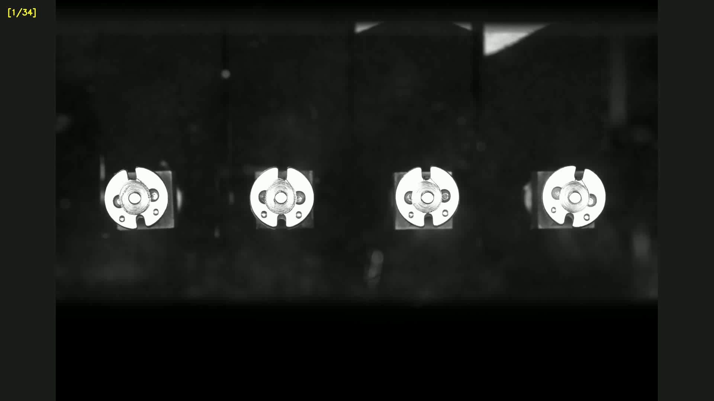
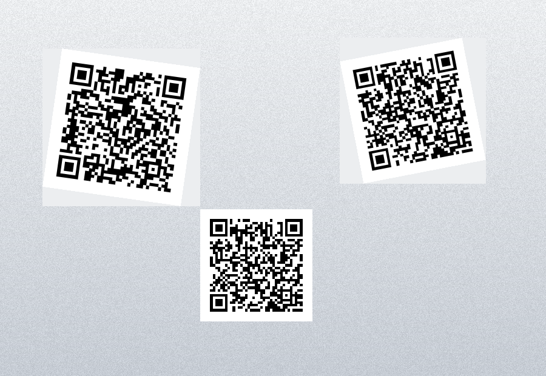
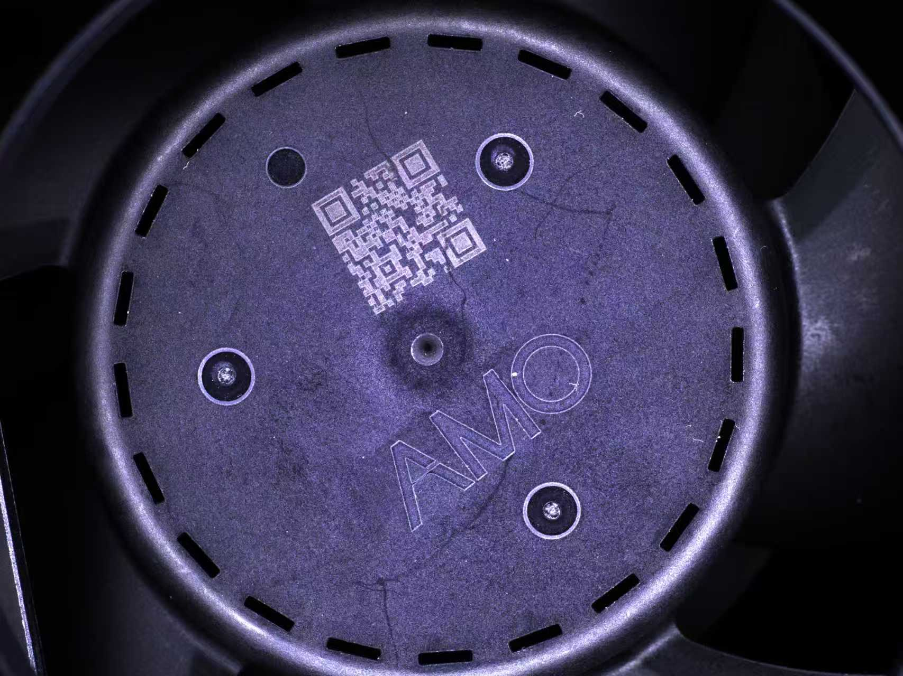

# 4 任务中文完整案例

> 配方格式：version 5。本目录包含配方和中文说明，测试图片统一放在上一级 `images/`，避免 7 套案例重复占用空间。

## 快速使用

1. 启动程序，选择菜单「文件(F) → 打开配方...」。
2. 打开 `04_tasks.recipe`。
3. 在右侧选择任务后点「执行当前任务」，或直接点「全部执行」。
4. 查看图像叠加结果和底部日志；OCR 第一次加载模型时会稍慢。

## 任务明细

| 序号 | 任务 | 图片 | 工具 | 中文说明 | 预期结果 |
| ---: | --- | --- | --- | --- | --- |
| 1 | 任务01-原图预览 | `../images/零件缺陷.jpg` | 原图 | 确认任务图片、尺寸与颜色通道是否正确。 | 显示 1920×1080 零件原图。 |
| 2 | 任务02-基础边缘 | `../images/零件缺陷.jpg` | 边缘检测 | 用 Canny 提取零件和纹理边缘。 | 显示主要轮廓和细节边缘。 |
| 3 | 任务03-灰度阈值 | `../images/零件缺陷.jpg` | 阈值调试 | 演示灰度、模糊和固定阈值二值化。 | 输出黑白分割图。 |
| 4 | 任务04-清晰二维码 | `../images/清晰二维码.png` | 二维码识别 | 演示未绑定 ROI 时对整图识别二维码。 | 标出二维码并显示解码文本。 |

## 配图

### 零件缺陷

### 清晰二维码

### 复杂二维码

### 中文文字

## ROI 与路径规则

- 边缘、阈值、Blob、轮廓、形态学、直线、颜色、二维码和 OCR 均未绑定 ROI，因此执行整图。
- 工业测量任务在工具内部明确保存了点或线 ROI，不依赖画布上临时绘制的 ROI。
- 配方只保存相对路径；移动案例时请复制整个 `task_series` 目录，不要只复制某个 `.recipe` 文件。
- 任务数和工具数均为 4，每个任务恰好绑定一个演示工具，便于逐项观察。
